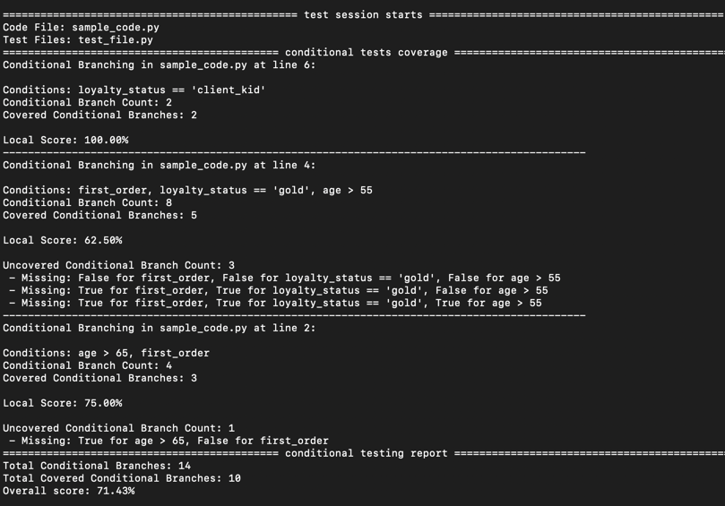

# Conditional Testing Module in Python
## Overview:
This repository implements conditional testing in Python.

The file conditional_testing.py contains the source code, file sample_code.py is a sample code
to be used in testing, test_file.py is a sample test file and the file tests_missing.py provides the tests
missing from test_file.py to reach 100% conditional coverage.

## Report example



## Running locally
### For a general code file and testing files:
```bash
python3 conditional_testing.py <code_file.py> <testing_files.py>
```

### For the code and testing files provided in the repository:
```bash
python3 conditional_testing.py sample_code.py test_file.py tests_missing.py
```
